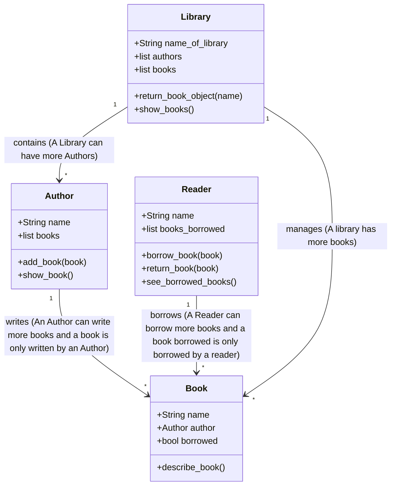

# Library System OOP

## 🧩Short Description

In this project I created a system so that a user can start the app and begin the process of working with a library. He can choose from the list of libraries and after that for every library he has some options that he can perform.

## Structure of the project

```

📁 Library Sisitem OOP/
│
├── 📄 classes.py              # Defines the classes that I use in the project
├── 📄 libraries.py            # Contains the info for every library
├── 📄 main.py                 # The stating point of the app, here the logic of the app runs
├── 📄 set_class_library.py    # Creates the library objects
│
└── 📄 README.md               # Here is the readme file that explains the project

```

## Structure of the classes

### **Author**
- Represents an author of books.  
- **Attributes:**
  - `name` → author's name  
  - `books` → list of books written by the author  
- **Methods:**
  - `add_book(book)` → adds a book to the author's list  
  - `show_book()` → displays all books written by the author  

---

### **Book**
- Represents a book.  
- **Attributes:**
  - `name` → book's title  
  - `author` → the author of the book (an `Author` object)  
  - `borrowed` → book status (`True` if borrowed)  
- **Methods:**
  - `describe_book()` → displays information about the book and its availability  

---

### **Reader**
- Represents a library reader who can borrow and return books.  
- **Attributes:**
  - `name` → reader's name  
  - `books_borrowed` → list of borrowed books  
- **Methods:**
  - `borrow_book(book)` → borrow a book  
  - `return_book(book)` → return a book  
  - `see_borrowed_books()` → display borrowed books  

---

### **Library**
- Represents the library that manages books and authors.  
- **Attributes:**
  - `name_of_library` → library's name  
  - `authors` → list of authors  
  - `books` → list of available books  
- **Methods:**
  - `return_book_object(name)` → searches for a book by name  
  - `show_books()` → displays available books  

---

## How Classes Interact

1. **Author → Book:**  
   - An author can have multiple books.  
   - Each book references its author.  

2. **Reader → Book:**  
   - A reader can borrow books, which changes the `borrowed` status.  
   - Returning a book resets the status to available.  

3. **Library:**  
   - The library manages all books and authors.  
   - It can display available books and search books by name.  

---

## Class Relationships Diagram (Mermaid)



## ⚙️How to run it on your machine

Simply clone the repo in your own machine and it should work just fine.

## 🧠Conclusion

This project demonstrates a simple but functional **library management system**.  
It models real-world relationships between authors, books, readers, and the library, allowing users to:  

- Show books available in the library  
- See the list of authors
- Borrow a book  
- Return a book
- See the list of borrowed books

It was a great project because I learned and practiced a lot of concept for OOP.